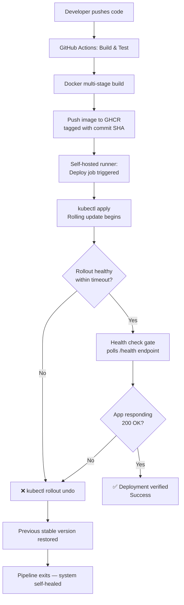
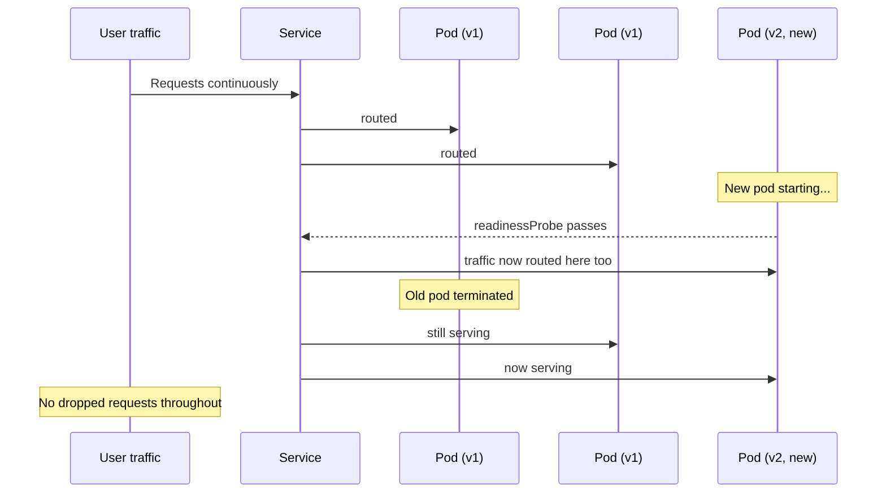

# 🛡️ Guardrail

**A self-healing CI/CD pipeline for Kubernetes — zero-downtime deploys with automated health verification and rollback.**

Built to solve a common production problem: deployments that fail silently and require manual firefighting. Guardrail deploys, verifies, and heals itself — no human intervention required when something goes wrong.

---

## 🎯 Problem Statement

> Manual production deployments lack automated health validation and rollback, leading to prolonged downtime when a bad release is pushed. Engineers are forced to manually diagnose and patch under pressure, increasing recovery time and blast radius.

**Guardrail solves this** by making every deployment self-verifying and self-healing:

```
Bad deploy goes out  →  Health check fails  →  System rolls back automatically  →  Zero manual intervention
```

---

## 🏗️ Architecture



---

## 🔁 Zero-Downtime Rolling Update Flow



---

## ⚙️ Tech Stack

| Layer | Tool | Why |
|---|---|---|
| Application | **Go** | Compiles to a static binary — enables minimal container images |
| Containerization | **Docker (multi-stage build)** | Separates build environment from runtime for a tiny, secure final image |
| Orchestration | **Kubernetes (kubeadm)** | Native rolling updates, self-healing, declarative infra |
| CI | **GitHub Actions** | Automated build, test, tag, and push on every commit |
| CD | **GitHub Actions (self-hosted runner)** | Deploys directly to a private, non-internet-facing cluster |
| Registry | **GitHub Container Registry (GHCR)** | Immutable, SHA-tagged image storage |
| Verification | **Custom Bash health-check gate** | Independent, second layer of health verification beyond Kubernetes' own probes |

---

## 📊 Results & Numbers

| Metric | Result |
|---|---|
| **Final container image size** | **~12.1 MB** (vs. typical 150–200MB Python/Node images) |
| **Base build image (discarded)** | ~800 MB — never shipped, thanks to multi-stage builds |
| **Replica count** | 3 pods per deployment |
| **Max unavailable during rollout** | 1 pod (2 of 3 always serving traffic) |
| **Health check gate timeout** | 60 seconds, polled every 3 seconds |
| **Rollout timeout before auto-rollback** | 90 seconds |
| **Downtime during a healthy deploy** | **0 seconds** (verified via continuous curl loop during live rollout) |
| **Downtime during a failed deploy** | **0 seconds** — traffic never routed to the broken version at all; auto-rollback restored last-good revision automatically |
| **Manual steps required on failure** | **0** — fully automated detection + rollback |

---

## 🔢 Versioning Strategy

- Every image is tagged with its **Git commit SHA** (`ghcr.io/.../guardrail:<sha>`) — never `:latest` in deployments.
- This makes every running version **traceable back to an exact commit**.
- `kubectl rollout undo` uses Kubernetes' built-in revision history to restore the exact prior image — no guessing what "last stable" means.

```
ghcr.io/gaouravpatil/guardrail:b040f7f4838f3f4302468c30cca9f2b5940481ba
                                └──────────────── commit SHA ────────────────┘
```

---

## ✅ Phases Completed

| Phase | Description | Status |
|---|---|---|
| 1 | Containerized Go app with multi-stage Docker build | ✅ Done |
| 2 | Pushed to GitHub, version control established | ✅ Done |
| 3 | GitHub Actions CI — build, test, tag, push to GHCR | ✅ Done |
| 4 | Deployed to Kubernetes with rolling update strategy | ✅ Done |
| 5 | Live zero-downtime rolling update demonstrated (v1 → v2) | ✅ Done |
| 6 | Independent health-check gate script (`health-check.sh`) | ✅ Done |
| 7 | Automated rollback on failed health check | ✅ Done |
| 7b | Full CI/CD wiring via self-hosted runner — push-to-deploy, fully automated | ✅ Done |

---

## 🔮 Future Scope — Phase 8: Observability

Not yet built. Planned additions:

- **Prometheus** — scrape request count, error rate, and latency metrics from the app
- **Grafana** — visual dashboard with deployment events annotated directly on metrics graphs
- Goal: go from *"the pipeline knows it healed itself"* to *"the team can see it happen and correlate it with real traffic patterns"*

---

## 🧠 What This Project Demonstrates

- Multi-stage Docker builds for minimal, secure production images
- Kubernetes rolling updates with `readinessProbe` / `livenessProbe` gating
- CI/CD pipeline design with distinct build and deploy stages
- Self-hosted GitHub Actions runners for deploying to private/non-public infrastructure
- Defense-in-depth health verification (Kubernetes' own probes **+** an independent external check)
- Automated rollback using Kubernetes' native revision history
- Immutable, traceable image versioning via commit SHA tagging

---

## 📁 Project Structure

```
guardrail/
├── .github/workflows/ci.yml     # CI (build/push) + CD (deploy/verify) pipeline
├── Dockerfile                   # Multi-stage build → ~12.1MB final image
├── main.go                      # App with /health endpoint
├── go.mod
├── k8s/
│   ├── deployment.yaml          # Rolling update strategy, probes
│   └── service.yaml             # NodePort service
└── scripts/
    ├── health-check.sh          # Independent health verification gate
    └── deploy-and-verify.sh     # Orchestrates deploy → verify → rollback
