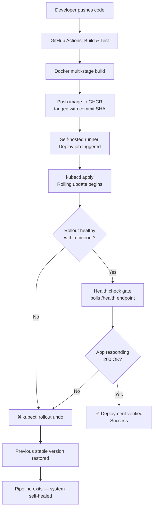
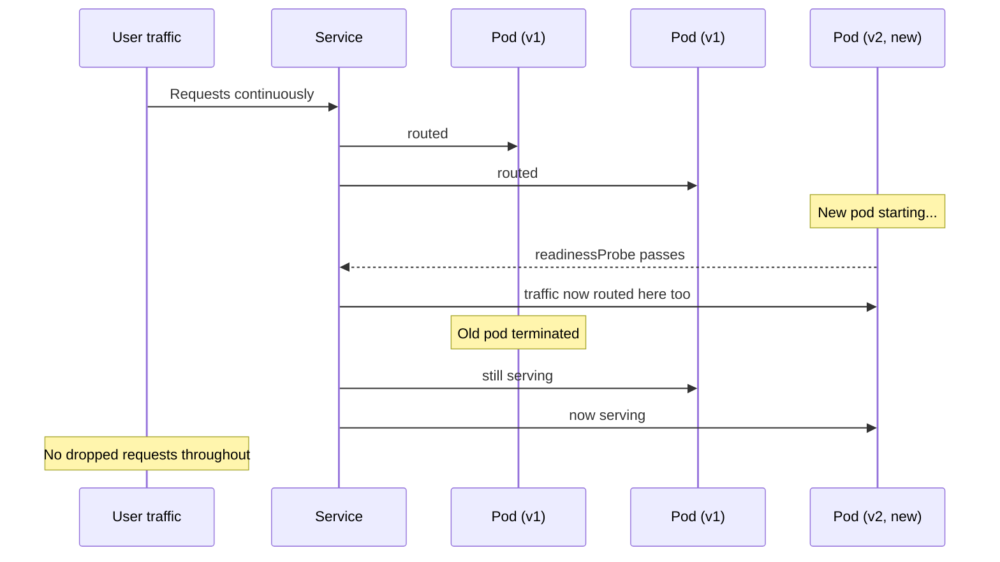
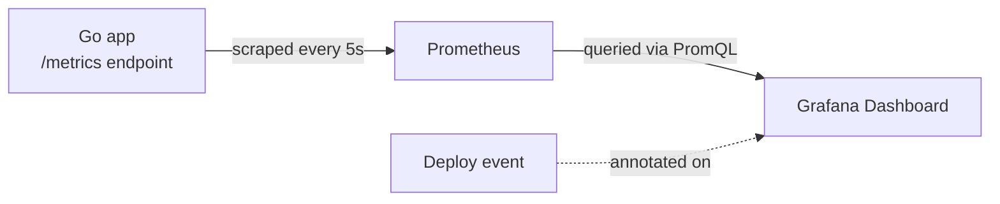

# 🛡️ Guardrail

**A self-healing CI/CD pipeline for Kubernetes — zero-downtime deploys with automated health verification and rollback.**

Built to solve a common production problem: deployments that fail silently and require manual firefighting. Guardrail deploys, verifies, and heals itself — no human intervention required when something goes wrong.

---

## 🎯 Problem Statement

> Manual production deployments lack automated health validation and rollback, leading to prolonged downtime when a bad release is pushed. Engineers are forced to manually diagnose and patch under pressure, increasing recovery time and blast radius.

**Guardrail solves this** by making every deployment self-verifying and self-healing:

```
Bad deploy goes out  →  Health check fails  →  System rolls back automatically  →  Zero manual intervention
```

---

## 🏗️ Architecture


```mermaid
flowchart TD
    A[Developer pushes code] --> B[GitHub Actions: Build & Test]
    B --> C[Docker multi-stage build]
    C --> D[Push image to GHCR<br/>tagged with commit SHA]
    D --> E[Self-hosted runner:<br/>Deploy job triggered]
    E --> F[kubectl apply<br/>Rolling update begins]
    F --> G{Rollout healthy<br/>within timeout?}
    G -->|Yes| H[Health check gate<br/>polls /health endpoint]
    G -->|No| K[❌ kubectl rollout undo]
    H --> I{App responding<br/>200 OK?}
    I -->|Yes| J[✅ Deployment verified<br/>Success]
    I -->|No| K
    K --> L[Previous stable version restored]
    L --> M[Pipeline exits — system self-healed]
```

---

## 🔁 Zero-Downtime Rolling Update Flow


```mermaid
sequenceDiagram
    participant U as User traffic
    participant S as Service
    participant P1 as Pod (v1)
    participant P2 as Pod (v1)
    participant P3 as Pod (v2, new)

    U->>S: Requests continuously
    S->>P1: routed
    S->>P2: routed
    Note over P3: New pod starting...
    P3-->>S: readinessProbe passes
    S->>P3: traffic now routed here too
    Note over P1: Old pod terminated
    S->>P2: still serving
    S->>P3: now serving
    Note over U: No dropped requests throughout
```

---

## ⚙️ Tech Stack

| Layer | Tool | Why |
|---|---|---|
| Application | **Go** | Compiles to a static binary — enables minimal container images |
| Containerization | **Docker (multi-stage build)** | Separates build environment from runtime for a tiny, secure final image |
| Orchestration | **Kubernetes (kubeadm)** | Native rolling updates, self-healing, declarative infra |
| CI | **GitHub Actions** | Automated build, test, tag, and push on every commit |
| CD | **GitHub Actions (self-hosted runner)** | Deploys directly to a private, non-internet-facing cluster |
| Registry | **GitHub Container Registry (GHCR)** | Immutable, SHA-tagged image storage |
| Verification | **Custom Bash health-check gate** | Independent, second layer of health verification beyond Kubernetes' own probes |
| Metrics | **Prometheus** | Scrapes and stores time-series data from the app's `/metrics` endpoint |
| Dashboards | **Grafana** | Visualizes request rate and latency, with deploys annotated on the timeline |

---

## 📊 Results & Numbers

| Metric | Result |
|---|---|
| **Final container image size** | **~12.1 MB** (vs. typical 150–200MB Python/Node images) |
| **Base build image (discarded)** | ~800 MB — never shipped, thanks to multi-stage builds |
| **Replica count** | 3 pods per deployment, spread across nodes via `topologySpreadConstraints` |
| **Max unavailable during rollout** | 0 pods (3 of 3 always serving traffic) |
| **Health check gate timeout** | 60 seconds, polled every 3 seconds (validates body + `EXPECTED_VERSION`) |
| **Rollout timeout before auto-rollback** | 120 seconds (matches `progressDeadlineSeconds`) |
| **Downtime during a healthy deploy** | **0 seconds** (rolling update with `maxUnavailable: 0`; verify with 5s-scrape Prometheus + continuous curl) |
| **Downtime during a failed deploy** | **~0 seconds when readiness gates hold** — traffic is only sent to `Ready` pods; a version that returns `200` on `/health` but `500` on `/` can still serve errors until the external gate rolls back — hence the version-aware `health-check.sh` + `rollout undo` |
| **Manual steps required on failure** | **0** — fully automated detection + rollback (pipeline still exits non-zero so the failure is visible) |

---

## 🔢 Versioning Strategy

- Every image is tagged with its **Git commit SHA** (`ghcr.io/.../guardrail:<sha>`) — never `:latest` in deployments (CI deploys via `kubectl set image`, never `sed` on YAML).
- `APP_VERSION` is injected at deploy time (`kubectl set env ... APP_VERSION=<sha>`) so `/health` reports the exact running SHA — default `dev` never masquerades as a release.
- This makes every running version **traceable back to an exact commit**.
- `kubectl rollout undo` uses Kubernetes' built-in revision history (`revisionHistoryLimit: 10`) to restore the exact prior image — no guessing what "last stable" means.

```
ghcr.io/gaouravpatil/guardrail:b040f7f4838f3f4302468c30cca9f2b5940481ba
                                └──────────────── commit SHA ────────────────┘
```

---

## ✅ Phases Completed

| Phase | Description | Status |
|---|---|---|
| 1 | Containerized Go app with multi-stage Docker build | ✅ Done |
| 2 | Pushed to GitHub, version control established | ✅ Done |
| 3 | GitHub Actions CI — build, test, tag, push to GHCR | ✅ Done |
| 4 | Deployed to Kubernetes with rolling update strategy | ✅ Done |
| 5 | Live zero-downtime rolling update demonstrated (v1 → v2) | ✅ Done |
| 6 | Independent health-check gate script (`health-check.sh`) | ✅ Done |
| 7 | Automated rollback on failed health check | ✅ Done |
| 7b | Full CI/CD wiring via self-hosted runner — push-to-deploy, fully automated | ✅ Done |
| 8 | Observability — Prometheus metrics + Grafana dashboards | ✅ Done |

---

## 📈 Phase 8: Observability

The app is instrumented with the official Prometheus Go client, exposing a `/metrics` endpoint alongside `/`, `/health`, `/ready`, and `/live`. Two custom metrics were added (with real status codes, not hardcoded `200`):

- **`guardrail_requests_total`** (Counter) — total requests, labeled by `path` and `status`
- **`guardrail_request_duration_seconds`** (Histogram) — request latency, bucketed for percentile calculations

**Prometheus** runs as an in-cluster Deployment, scraping the app every 5 seconds via the in-cluster DNS name (`guardrail:5000`) — no hardcoded pod IPs — with 15d retention on a PVC. **Grafana** runs alongside it (pinned images, Secret password, PVC), connected to Prometheus as a data source, with a versioned dashboard (`k8s/monitoring/dashboards/guardrail.json`) tracking:

- **Request Rate by Endpoint** — `sum(rate(guardrail_requests_total[1m])) by (path)`
- **p95 Latency by Endpoint** — `histogram_quantile(0.95, sum(rate(guardrail_request_duration_seconds_bucket[5m])) by (le, path))`

Deployments can be manually annotated directly on the graph timeline, making it possible to visually confirm that request rate and latency stayed flat through a live rollout — the zero-downtime claim, proven visually rather than just in logs.


```mermaid
flowchart LR
    A[Go app<br/>/metrics endpoint] -->|scraped every 5s| B[Prometheus]
    B -->|queried via PromQL| C[Grafana Dashboard]
    D[Deploy event] -.annotated on.-> C
```

---

## 🧠 What This Project Demonstrates

- Multi-stage Docker builds for minimal, secure production images
- Kubernetes rolling updates with `readinessProbe` / `livenessProbe` gating
- CI/CD pipeline design with distinct build and deploy stages
- Self-hosted GitHub Actions runners for deploying to private/non-public infrastructure
- Defense-in-depth health verification (Kubernetes' own probes **+** an independent external check)
- Automated rollback using Kubernetes' native revision history
- Immutable, traceable image versioning via commit SHA tagging

---

## 📁 Project Structure

```
guardrail/
├── .github/workflows/ci.yml     # CI (vet/test/scan/push) + CD (immutable SHA deploy)
├── Dockerfile                   # Pinned multi-stage build → ~10MB static binary, non-root
├── .dockerignore                # Keeps build context ~12MB (excludes actions-runner/, .git)
├── main.go                      # App with /health, /ready, /live + real-status metrics
├── main_test.go                 # Unit tests (handlers, metrics, panic recovery)
├── go.mod
├── k8s/
│   ├── deployment.yaml          # RollingUpdate (maxUnavailable: 0), resources, probes, security
│   ├── service.yaml             # ClusterIP service (port-forward / Ingress for access)
│   └── monitoring/
│       ├── prometheus-config.yaml       # 5s scrape for guardrail job
│       ├── prometheus-deployment.yaml   # Pinned image, retention, PVC, ClusterIP
│       ├── prometheus-pvc.yaml          # 10Gi TSDB persistence
│       ├── grafana-deployment.yaml      # Pinned image, Secret password, PVC, ClusterIP
│       ├── grafana-pvc.yaml             # 5Gi dashboard persistence
│       ├── grafana-secret.yaml          # Placeholder — create real secret out-of-band
│       └── dashboards/guardrail.json    # Request-rate / p95 / error-rate dashboard (import)
└── scripts/
    ├── health-check.sh          # Version-aware gate (body + EXPECTED_VERSION check)
    └── deploy-and-verify.sh     # kubectl set image → verify → waited rollback
```

---

## 🚀 Getting Started

### Prerequisites

| Tool | Version | Purpose |
|---|---|---|
| **Go** | 1.23+ | Build the application locally |
| **Docker** | 20.10+ | Build container images |
| **kubectl** | 1.28+ | Interact with your Kubernetes cluster |
| **Kubernetes cluster** | 1.28+ | Runtime environment (kubeadm, minikube, or kind) |
| **Git** | 2.30+ | Version control |

### 1. Clone & Build Locally

```bash
# Clone the repository
git clone https://github.com/GaouravPatil/Guardrail.git
cd Guardrail

# Install Go dependencies
go mod download

# Build the binary
CGO_ENABLED=0 go build -o server main.go

# Run locally
./server
# → Server starts on http://localhost:5000
```

Verify it's running:

```bash
curl http://localhost:5000/health
# {"status":"healthy","version":"dev"}

curl http://localhost:5000/metrics
# Prometheus metrics output
```

### 2. Build the Docker Image

```bash
# Build the multi-stage image (~12.1 MB final size)
docker build -t guardrail:local .

# Run the container
docker run -p 5000:5000 guardrail:local
```

### 3. Deploy to Kubernetes

```bash
# Apply the service and deployment
kubectl apply -f k8s/service.yaml
kubectl apply -f k8s/deployment.yaml

# Verify pods are running (3 replicas)
kubectl get pods -l app=guardrail

# Check rollout status
kubectl rollout status deployment/guardrail
```

Access the app via port-forward (Service is ClusterIP; expose externally with an Ingress):

```bash
kubectl port-forward svc/guardrail 5000:5000
curl http://localhost:5000/health
```

### 4. Set Up Monitoring (Prometheus + Grafana)

```bash
# Create the real Grafana password first (never commit it):
kubectl create secret generic grafana-admin \
  --from-literal=admin-password='REPLACE-ME' --dry-run=client -o yaml | kubectl apply -f -

# Deploy Prometheus + Grafana (config, PVCs, deployments, ClusterIP services)
kubectl apply -f k8s/monitoring/prometheus-config.yaml
kubectl apply -f k8s/monitoring/prometheus-pvc.yaml
kubectl apply -f k8s/monitoring/prometheus-deployment.yaml
kubectl apply -f k8s/monitoring/grafana-pvc.yaml
kubectl apply -f k8s/monitoring/grafana-deployment.yaml

# Verify monitoring pods
kubectl get pods -l app=prometheus
kubectl get pods -l app=grafana
```

Access the dashboards:

```bash
# Prometheus UI
kubectl port-forward svc/prometheus 9090:9090
# → http://localhost:9090

# Grafana UI
kubectl port-forward svc/grafana 3000:3000
# → http://localhost:3000  (login: admin / password from grafana-admin Secret)
```

In Grafana, add Prometheus as a data source (`http://prometheus:9090`) and import `k8s/monitoring/dashboards/guardrail.json`:

- **Request Rate**: `sum(rate(guardrail_requests_total[1m])) by (path)`
- **p95 Latency**: `histogram_quantile(0.95, sum(rate(guardrail_request_duration_seconds_bucket[5m])) by (le, path))`
- **Error Rate**: `sum(rate(guardrail_requests_total{status!~"2.."}[1m])) by (path, status)`

### 5. CI/CD Pipeline Setup

The pipeline runs automatically on every push to `main`. To enable it on your fork:

1. **GHCR access** — GitHub Actions uses `GITHUB_TOKEN` (automatic) to push images to `ghcr.io`
2. **Self-hosted runner** — The deploy job runs on a self-hosted runner connected to your Kubernetes cluster:
   ```bash
   # On your cluster node, set up a GitHub Actions runner:
   # Settings → Actions → Runners → New self-hosted runner
   # Follow GitHub's setup instructions for Linux
   ```
3. **Push and watch** — Every push to `main` triggers: build → push to GHCR → deploy → health verify → auto-rollback if unhealthy

### 6. Test the Self-Healing Rollback

Simulate a bad deploy to see auto-rollback in action:

```bash
# Deploy a known-bad image tag
kubectl set image deployment/guardrail guardrail=ghcr.io/gaouravpatil/guardrail:nonexistent

# Watch Kubernetes detect the failure and the script roll back
./scripts/deploy-and-verify.sh
# → Health check fails → automatic rollback → previous version restored
```

---
